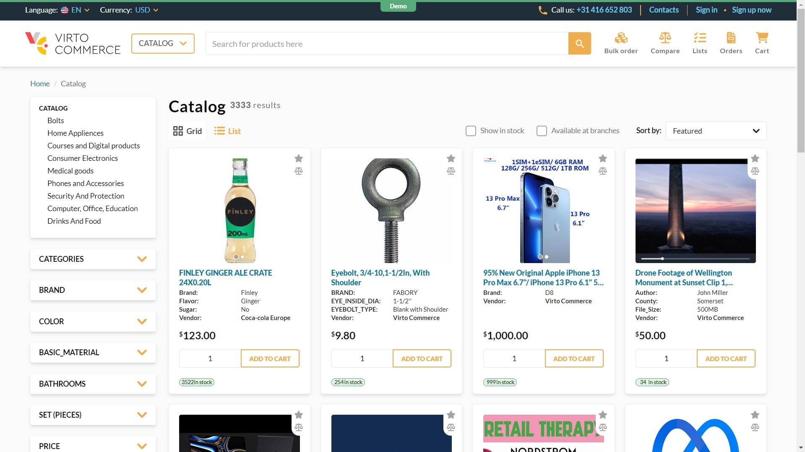

[](https://virtocommerce.atlassian.net/wiki/spaces/DE/pages/2329018420/Classification)    

# Virto Commerce Frontend



**Virto Commerce Frontend** is a single-page web application (SPA) with a fresh look on eCommerce solutions. This is where common B2B and B2C scenarios are combined with the most bleeding-edge technologies to deliver blazing-fast and fully functional solutions. It implements common business use cases needed for a vast majority of projects we build.

Virto Commerce Frontend is designed to be used as-is within the actual **Virto Commerce Platform**. You can modify it by implementing desired components, pages, and shared logic to correspond with your project goals.

## Technologies used

- **Vue3.** Progressive frontend framework with its key features allows to build fast applications.
- **Typescript.** All components and composables have type definitions, so IDE can help you to build clean and working code.
- **TailwindCSS.** The most popular and growing CSS framework provides a wonderful flexible structure to speed up styling.
- **Husky + ESLint + Prettier.** Autoformat, check and fix your code and prevent ugly code style within the repository.
- **Vite.** It is faster than Webpack. Really FASTER. Use it to develop with HMR benefits and to build for production.
- **GraphQL.** Forget about REST, use flexible GraphQL queries and mutations to safely work with the backend.

## Non-functional key features

- **Development performance.** Really fast development using the most effective solution. Enrol SPA in seconds and start to modify code with [HMR features](https://vitejs.dev/guide/api-hmr).
- **Client performance.** We are supposed to reach and hold green metrics provided by Google PageSpeed Insights.
- **[Atomic Design Pattern.](https://virtocommerce.com/atomic-architecture)** The Frontend Application UI is based on Atoms, Molecules and Organisms, combined within Pages and shared Components. This provides a high level of code reusability.
- **Fully responsive.** We made our Frontend Application work on multiple devices from Desktops to Mobile phones, concentrating both on UI and UX.
- **Simple styling and customization.** We use TailwindCSS to provide the easiest and most convenient way of CSS usage. Write as less of code as possible, and reuse existing highly customizable framework features.
- **Fully aligned with Virto Commerce Platform.** The SPA is fully aligned with the [Virto Commerce Platform](https://github.com/VirtoCommerce/vc-platform) to provide all common B2B and B2C scenarios. 

## The Application structure

```text
├── assets                           // Scripts, styles and other assets compiled and minified for production.
|
├── client-app                       // The main folder for the application.
|   ├── assets                       // Assets needed to be precompiled during building.
|   |   └──...
|   |
|   ├── core                         // Common utilities and shared logic that can be used by any pages and libraries.
|   |   ├── api/graphql              // GraphQL Models aligned with the Virto Backoffice.
|   |   |   └──...
|   |   ├── composables              // Core composables (app-level shared logic).
|   |   |   └──...
|   |   ├── directives               // Core Vue directives.
|   |   |   └──...
|   |   ├── plugins                  // Core Vue plugins.
|   |   |   └──...
|   |   ├── enums                    // Core enums.
|   |   |   └──...
|   |   ├── types                    // Core types.
|   |   |   └──...
|   |   ├── utilities                // Some miscellaneous utils.
|   |   |   └──...
|   |   └── constants.ts             // Global-available constants (DO NOT USE, will be removed later).
|   |
|   ├── pages                        // Set of application pages used within Application router.
|   |   └──...
|   |
|   ├── public                       // Statically served files
|   |   └── static
|   |       ├── icons                // Icons used for favicons, PWA, etc.
|   |       └── images               // Static images used inside the application.
|   |
|   ├── router                       // SPA routing configuration.
|   |   └──...
|   |
|   ├── shared                       // A set of shared files grouped by their domain context.
|   |   ├── catalog                  // Grouping context (ex.: catalog browsing).
|   |   |   ├── components           // The collection of components specific for this domain context.
|   |   |   |   └──...
|   |   |   ├── composables          // The collection of shared logic written using Composable API pattern.
|   |   |   |   └──...
|   |   |   ├── types                // Types used in this context.
|   |   |   |   └──...
|   |   |   ├── utils                // Utilities and helpers specific for this context.
|   |   |   |   └──...
|   |   |   └── index.ts             // Entry point for this context used as library.
|   |   |
|   |   └──...
|   |
|   ├── ui-kit                       // Atoms, Molecules, Organisms and their types, used within the whole application.
|   |   └──...
|   |
|   ├── App.vue                      // Main Application component. Use it as a wrapper for routable pages.
|   ├── env.d.ts                     // Definition file to provide IDE IntelliSense support.
|   ├── main.ts                      // Application entry point. Main initialization script.
|   ├── shims-acceptjs.d.ts          // Definition file to provide IDE IntelliSense support for Accept.js (Authorize.net).
|   ├── shims-graphql.d.ts           // Definition file to provide IDE IntelliSense support for importing *.graphql files.
|   ├── shims-vue.d.ts               // Definition file to provide IDE IntelliSense support for importing *.vue files.
|   ├── vue.d.ts                     // Definition file to provide IDE IntelliSense support for additional global Vue properties.
|   └── vue-router.d.ts              // Definition file to provide IDE IntelliSense support for additional global Vue Router properties.
|
├── config
|   ├── menu.json
|   └── settings_data.json
|   
├── locales                          // Locale files used to provide translated content.
|   └──...
|
├── scripts                          // Auxiliary build files that run in the Node environment.
|   └──...
|
├── .babelrc                         // Babel configuration for storybook
├── .browserslistrc                  // Browserslist config file to support actual versions of browsers.
├── .commitlintrc.json               // Config for Conventional commit hook.
├── .dependency-cruiser.cjs
├── .dependency-graph.cjs
├── .editorconfig                    // Common editor settings to sync codestyle.
├── .env                             // Envfile to define different Environment Variables.
├── .env.local                       // Local envfile to override Environment Variables.
├── .eslintignore                    // Ignore some files from ESlint.
├── .eslintrc.cjs                    // ESlint configuration file.
├── .gitattributes                   // Set attributes to specified path in Git.
├── .gitignore                       // Ignore some files from Git.
├── .npmrc                           // Node.js package manager settings and Node.js restrictions
├── .prettierignore                  // Ignore some files from Prettier.
├── .prettierrc.json                 // Config for Prettier.
├── .yarnrc.yml                      // Yarn package manager configuration
├── graphql-codegen
|   ├── schema.ts                    // Configuration file to generate GraphQL schema.
|   ├── generator.ts                 // Generate types based on schema.json
|   └── config.cjs                   // Environment configuration 
├── index.html                       // Vite Development entry point.
├── LICENSE.txt
├── package.json                     // NPM Package description.
├── postcss.config.cjs               // PostCSS configuration for Tailwind.
├── README.md                        // This file.
├── sonar-project.properties
├── tailwind.config.ts               // TailwindCSS configuration file.
├── tsconfig.app.json                // Typescript configuration for application.
├── tsconfig.json                    // Main TypeScript configuration file.
├── tsconfig.node.json               // Typescript configuration for Node.js.
├── tsconfig.vitest.json
├── vite.config.ts                   // Vite configuration file.
├── vitest.config.ts
└── yarn.lock                        // Yarn dependencies lock file.
```

## Getting started

### Prerequisites

- Install `vc-platform` 3.x the latest version. [Deploy on Windows](https://github.com/VirtoCommerce/vc-platform/blob/master/docs/getting-started/deploy-from-precompiled-binaries-windows.md) or [Deploy on Linux](https://github.com/VirtoCommerce/vc-platform/blob/master/docs/getting-started/deploy-from-precompiled-binaries-linux.md)
- Install `vc-module-experience-api` module. [Getting started](https://github.com/VirtoCommerce/vc-module-experience-api/blob/dev/docs/getting-started.md)
- Install [vc-module-profile-experience-api](https://github.com/VirtoCommerce/vc-module-profile-experience-api) module.
- Install [vc-module-file-experience-api](https://github.com/VirtoCommerce/vc-module-file-experience-api) module.
- Install [vc-module-push-messages](https://github.com/VirtoCommerce/vc-module-push-messages) module.
  Install [vc-module-skyflow](https://github.com/VirtoCommerce/vc-module-skyflow)
- Install [Node.js v22](https://nodejs.org/en/download/) (**22.11.0** or later)
- Enable [corepack](https://yarnpkg.com/corepack) *(run as administrator on Windows)*
  ```bash
  corepack enable
  ```
- If you have installed `yarn` globally, uninstall it:
  - via `npm`
    ```bash
    npm uninstall --global yarn
    ```
  - or through your Operation System installation tools
     - `Control Panel`, `Chocolatey` or `Scoop` on *Windows*
     - `Launchpad`, `Finder`, `Homebrew` or `MacPorts` on *macOs*
     - Native package manager such as `apt` on *Linux*

### Clone repository
```bash
git clone https://github.com/VirtoCommerce/vc-theme-b2b-vue.git "C:\vc-theme-b2b-vue\"
```

### Check yarn version
```bash
yarn -v
```
`Yarn` should be of version **4.1.0** or greater, not 1.XX.

### Install dependencies
```bash
yarn install
```

### Build

#### Run with hot reload for development

- Add new **.env.local** file
- Copy **APP_BACKEND_URL** from **.env** file and change it's value to the correct endpoint to `Virto Commerce Platform`:

```dotenv
# .env.local file
APP_BACKEND_URL=https://localhost:5001
```

- Run command: `yarn dev` or `yarn dev-expose`
- Follow the link in the terminal

#### Build with validation and minification for production

```bash
yarn build
```

#### Build in development mode

```bash
yarn build:dev
```

#### Build in development mode with change tracking

```bash
yarn build:watch
```

## Types generation

Command:
```
yarn generate:graphql
```
makes two steps:
1. Downloads `schema.json` from GraphQL server located at the `APP_BACKEND_URL`
2. Generates the `types.ts` file separately for general modules and independent modules.

If independent modules are not installed on `The Platform`, types can still be safely generated.

## Dependency Analysis

### Bundle Size Analysis

To examine the sizes of various chunks such as `vendor.js` or `index.js`, execute the following command:
```
yarn generate:bundle-map
```
The results will be located in the `artifacts` folder.

### Visualizing the Dependency Graph

To create a visual representation of the dependency graph, use the following command:
```
yarn generate:dependency-graph
```
**Note**: This command requires parameters to run successfully. For example:
```
yarn generate:dependency-graph client-app/main.ts client-app/shared/account/components/checkout-default-success-modal.vue
```
The generated graph will also be saved in the `artifacts` folder.

### Troubleshooting

If you encounter an error such as `dot command not found` on Windows, ensure that [Graphviz](https://graphviz.gitlab.io/download/) is installed on your system.

## License

Copyright (c) Virtosoftware Ltd. All rights reserved.

Licensed under the Virto Commerce Open Software License (the "License"); you
may not use this file except in compliance with the License. You may
obtain a copy of the License at

[https://virtocommerce.com/opensourcelicense](https://virtocommerce.com/opensourcelicense)

Unless required by applicable law or agreed to in writing, software
distributed under the License is distributed on an "AS IS" BASIS,
WITHOUT WARRANTIES OR CONDITIONS OF ANY KIND, either express or
implied.
