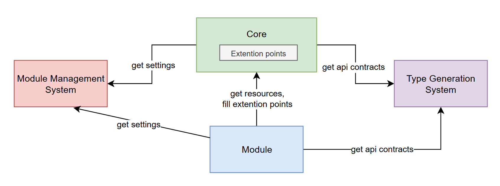

# Modules Guide

Welcome to the **Modules Guide**! This documentation will help you understand how to create and manage modules within the project. Modules are the building blocks of our application, promoting scalability and maintainability.

## Modules Architecture

**Why Modules Architecture:**

- **Scalability:** Easily add new features without affecting existing ones.
- **Maintainability:** Isolated codebases make it easier to manage and debug.
- Any **Module** in the `/modules` folder can be safely removed without affecting **Core**
- **Clear Control** by decision-making person. 

### Core
The **Core** is the main application that includes the API, router, builder, and other systems.

### [Module](#what-is-a-module)
A **Module** is an additional functionality developed with minimal impact on the **Core**.

### Extension points
**Extension points** are belong to the **Core**. Also called **Holes** or **Sockets**
### Existing Extension points:
- `client-app/shared/common/composables/useCustomProductComponents.ts`
- `client-app/shared/layout/composables/useCustomAccountLinkComponents.ts`
- `client-app/shared/layout/composables/useCustomHeaderLinkComponents.ts`
- `client-app/shared/layout/composables/useCustomMobileHeaderComponents.ts`
- `client-app/shared/layout/composables/useCustomMobileMenuLinkComponents.ts`

### Module Management System
The **Module Management System** is the decision-making point and business logic handler. It is represented as a [settings_data.json](../config/settings_data.json) as a bundle level and an array of `modules` in the `getStore` request as a store level settings. Could be considered as a "Feature Flags".

### [Type Generation System](#what-is-a-type-generation-system)
The **Type Generation System** handles the generation of types and constants for GraphQL API.

---

## Entity Relationships



## What is a Module?

A **module** is a self-contained feature area within the application. Each module encapsulates its own components, services, APIs, and other related code. Examples include modules for quotes management, user reviews, notifications and back-in-stock subscriptions.

---

## Folder Structure

Organizing your module with a consistent structure ensures clarity and ease of navigation. Here's the recommended structure for a module:

```
your-module/
├── api/
│   ├── graphql/
│   │   └── types.ts
├── components/
│   └── YourComponent.vue
├── composables/
│   └── useYourFeature.ts
├── pages/
│   ├── YourModulePage.vue
│   └── index.ts
├── localization/
│   ├── en.json
│   └── de.json
├── types/
│   └── index.ts
└── index.ts
```

- **api/**: Contains all API-related code, including GraphQL schemas and generated types.
- **components/**: Vue components specific to the module.
- **composables/**: Vue composables (hooks) for shared logic within the module.
- **pages/**: Module-specific pages that integrate with the application's routing.
- **localization/**: Localization files for supporting multiple languages.
- **types/**: TypeScript interfaces and types for the module.
- **index.ts**: Entry point exporting public APIs (mainly init function).

## What is a Type Generation System?

Each module typically includes its own GraphQL types, often defined in a `types.ts` file within an `api/graphql` folder. These types **are generated** using the following npm command:

```bash
yarn generate:graphql-types
```

This command triggers the execution of the generator.ts script, which is responsible for generating the types.ts files for both the core application and the independent modules.

The `scripts/graphql-codegen/generator.ts` file also plays a crucial role in handling standalone GraphQL schemas. It includes an array called `independentModules`, where each object represents a separate GraphQL schema that needs to be generated independently.

```typescript
 {
    name: "YourModule",
    apiPath: "client-app/modules/your-module/api/graphql",
    schemaPath: `${process.env.APP_BACKEND_URL}/graphql/your-module`,
  },
```

---


### Registering Routes

Modules register their routes through an `init` function within the module. This function is called during the application's initialization phase, typically in the `app-runner.ts`.

#### Module Initialization Interface

Each module should export an `init` function that accepts the router and other necessary dependencies (e.g., i18n).

```typescript
// modules/your-module/index.ts
import { Router } from "vue-router";
import { I18n } from "@/i18n";

// Define your components
const YourModulePage = () => import("./pages/YourModulePage.vue");
// By using () => import('./pages/YourModulePage.vue'), you ensure that Vue Router can handle the component as a lazy-loaded route, which is the intended usage pattern.

export async function init(router: Router, i18n: I18n): Promise<void> {
  const route = {
    path: "/your-module",
    name: "YourModule",
    component: YourModulePage,
    beforeEnter(to: any, from: any, next: Function) {
      // Add any route guards or logic here
      next();
    },
  };

  router.addRoute(route);
}
```

---

### Example of Initialization Function Usage

To integrate a module into the main application, you need to import the module's `init` function and call it within the app's runner. Below is an example of how to do this:

```typescript
// client-app/app-runner.ts

// Import the module's init function
import { init as initYourModule } from "@/modules/your-module";

...

initYourModule(router, i18n);

```

---

## Best Practices

To ensure consistency and high quality across all modules, follow these best practices:

1. **Consistent Structure:**

  - Adhere to the recommended folder structure.
  - Keep related files grouped together.

2. **Isolate Module Logic:**

  - Avoid cross-module dependencies unless necessary.
  - Use the module's `composables` for shared logic.

3. **Type Safety:**

  - Define clear TypeScript types in the `types/` directory.
  - Ensure all API interactions use generated GraphQL types.

4. **Documentation:**

  - Document public APIs, components, and composables.
  - Keep the `README.md` updated with relevant information.

5. **Naming Conventions:**

  - Use clear and descriptive names for files and functions.
  - Follow the project's naming guidelines.

6. **Testing:**
  - Write unit and integration tests for module functionalities.
  - Ensure tests are located alongside the code they test.

---

Happy coding! 🚀 If you have any questions or need further assistance, feel free to reach out to the development team.
